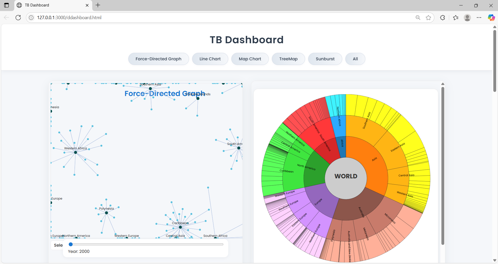
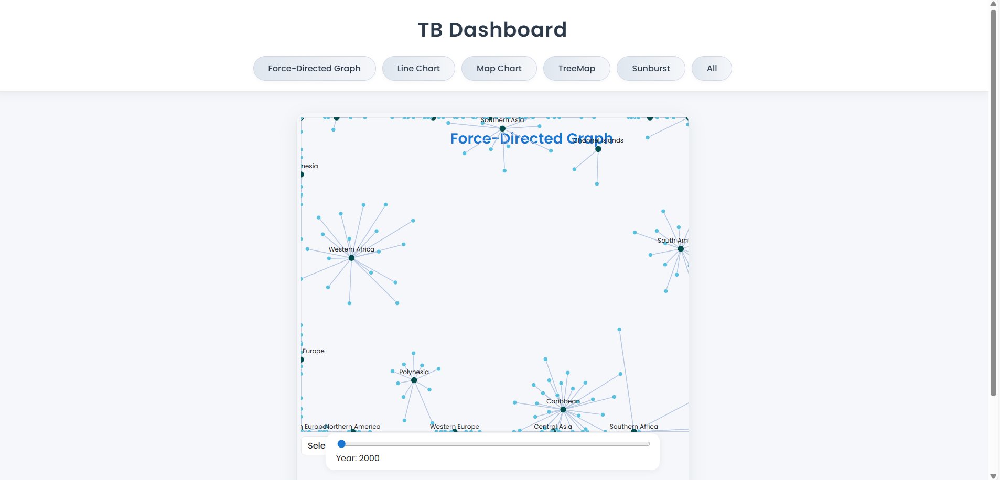
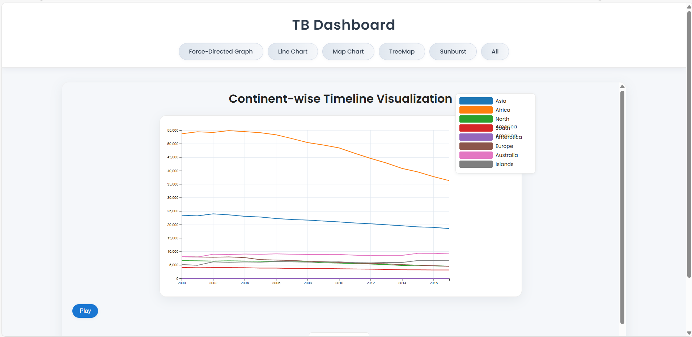
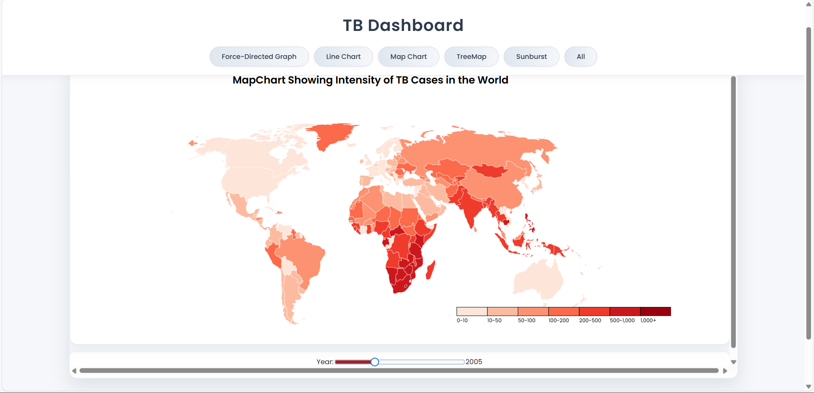
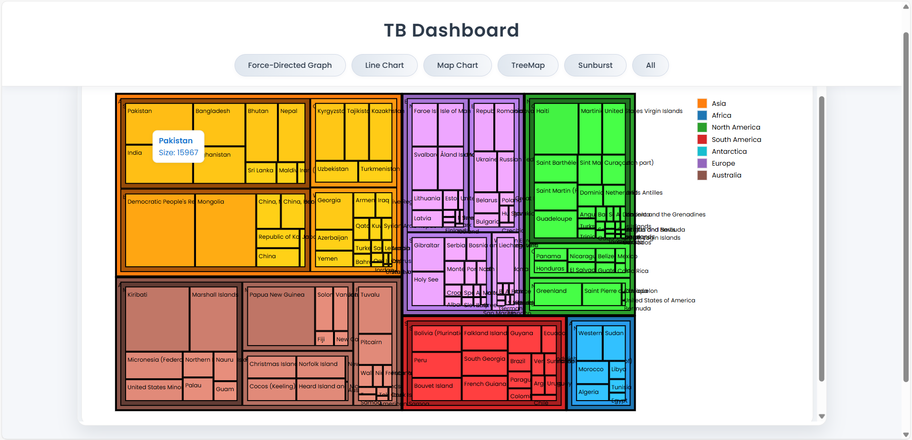
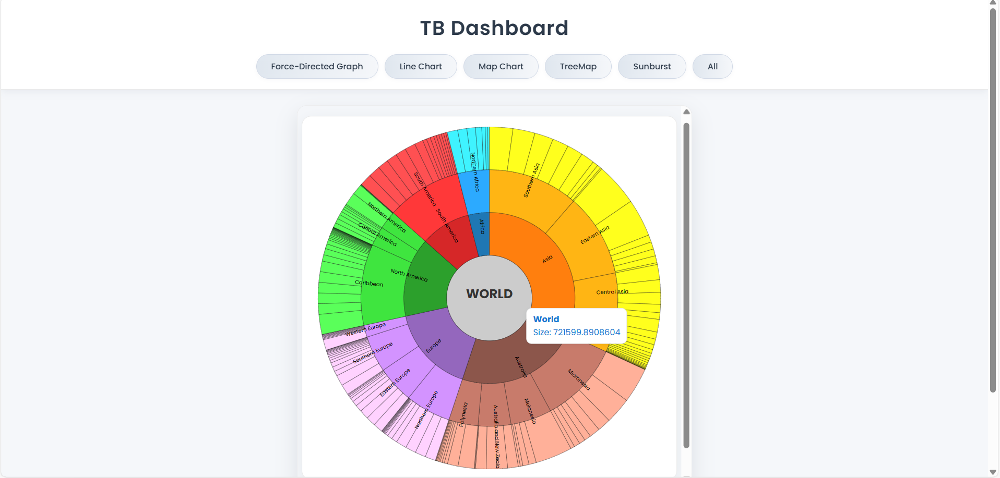

# 🌍 TB Data Visualization Dashboard

[](LICENSE)
[](https://d3js.org/)
[](https://pandas.pydata.org/)
[]()
[](https://jupyter.org/)

An interactive data visualization dashboard for exploring and analyzing global Tuberculosis (TB) incidence data (2000–2017). Features advanced, interactive charts including force-directed graphs, maps, timelines, treemaps, sunbursts, and a unified dashboard interface.

---
## Features

- Interactive dashboard integrating five visualizations:
  - Force-Directed Graph
  - Timeline Line Chart
  - Geographical Map Chart
  - Treemap
  - Sunburst Chart
- Cleaned and preprocessed dataset (2000–2017) with imputed missing values.
- Drill-down, zoom, hover, and filter capabilities in all visualizations.
- Responsive and user-friendly design for seamless exploration.

---
## 📂 Dataset

- Source: [UN Global Tuberculosis Dataset](https://data.amerigeoss.org/dataset/indicator-3-3-2-tuberculosis-incidence-per-100000-population/resource/c846bcb2-20a8-49d3-955a-046b52344c88)
- Covers: TB incidence per 100,000 population from **2000 to 2017**

### Preprocessing Workflow:
- Removed irrelevant columns (`goal`, `target`, `indicator`, etc.)
- Computed and analyzed null value percentages.
- Imputed missing values:
  - Numeric columns → mean
  - Categorical columns → mode
- Row-level imputation of year columns (`value_2000`–`value_2017`) with row mean.
- Output: Cleaned dataset saved as `preprocessed_data.csv`.

---
## 📊 Visualizations

### Dashboard
Central hub displaying all five interactive visualizations.


### Force-Directed Graph
Relationship mapping of continents, regions, and countries.


### Timeline Line Chart
Temporal trend of TB incidence by continent (2000–2017).


### Geographical Map
Global TB incidence map with heatmap and choropleth styling.


### Treemap
Hierarchical rectangular visualization of TB cases by geography.


### Sunburst Chart
Hierarchical circular visualization showing continent → region → country.


---
## 🗂️ Project Structure

```
├── ddashboard.html              # Main integrated dashboard
├── forceddirected.html          # Force-Directed Graph
├── timeline.html                # Timeline Line Chart
├── mapchart.html                # Geographical Map
├── treemap.html                 # Treemap
├── sunburst.html                # Sunburst Chart
├── pre-processing.ipynb         # Data cleaning and preprocessing notebook
├── preprocessed_data.csv        # Cleaned dataset
├── Report.pdf                   # Full project report
├── images/                      # Screenshots
│   ├── img1.png                 # Dashboard
│   ├── img2.png                 # Force Directed
│   ├── img3.png                 # Line Chart
│   ├── img4.png                 # Map Chart
│   ├── img5.png                 # Treemap
│   └── img6.png                 # Sunburst
└── README.md                    # Project documentation
```

## 🚀 Getting Started

### 1. Clone the Repository

```bash
git clone https://github.com/Saim-Nadeem/tb-data-visualization-dashboard.git
cd tb-data-visualization-dashboard
```

### 2. View the Dashboard

Open the file in your browser:

```bash
ddashboard.html
```

Or view individual visualizations by opening any `.html` file directly.

### 3. Reproduce Preprocessing

Open the Jupyter notebook to regenerate the cleaned dataset:

```bash
jupyter notebook pre-processing.ipynb
```

This will output `preprocessed_data.csv`.

---

## Results

The dashboard reveals:
- Temporal trends in TB incidence
- Geographic disparities and hotspots
- Hierarchical contributions at continent, region, and country level

---
## 📄 License

Licensed under the **MIT License**.
See the [LICENSE](LICENSE) file for more details.

---
## 👤 Author

**Saim Nadeem**
🔗 GitHub: [Saim-Nadeem](https://github.com/Saim-Nadeem)

---
## 🤝 Contributing

Contributions are welcome!
- Fork the repository
- Create a feature branch (`git checkout -b feature-name`)
- Commit your changes
- Push and open a pull request
